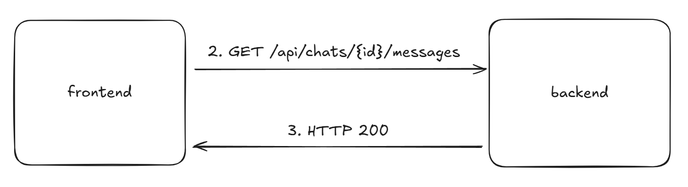

[TOC]


# Регистрация пользователя на сайте

## Назначение

Позволяет создать нового пользователя в системе.  Запрос выполняется на клиенте при заполнении формы регистрации (логин, email, пароль).
На данный запрос сервер возвращает токен для последующей работы с сервером.

## Сценарий использования 

1. Пользователь заполняет форму на клиенте
2. Клиент отправляет запрос на сервер для попытки регистрации пользователя

```http
POST http://localhost:8081/api/auth/register HTTP/1.1
Content-Type: application/json

{
    "email": "email@gmail.com",
    "login": "login",
    "password": "password"
}
```

- **email** - email пользователя. Сервер делает валидацию данного поля перед созданием пользователя, что может вызвать ошибку 401.
- **login** - login пользователя. Сервер выполняет следующую валидацию: длина больше 3 символов.
- **password** - пароль пользователя. Сервер выполняет следующую валидацию: длина больше 8 символов.

3. Сервер отправляет токен, который будет храниться на клиенте в **cookie**

   ```http
   HTTP/1.1 200 OK
   
   {
       "token": "jhgFy7ffjF028JBjgt2J..."
   }
   ```

## Схема сценария


## Возможные ошибки

1. **401 UNAUTHORIZED**

   Invalid data: некоторые поля не прошли валидацию или пустые

   Тело ответа:

   ```json
   {
       "error": "Invalid data",
       "details": {
           "email": "Email format is invalid",
           "password": "Password must be at least 8 characters"
       }
   }
   ```

   - **error** - тип ошибки
   - **details** - содержит в качестве ключей поля, которые не прошли валидацию и сообщения к ним

2. **404 NOT FOUND**

   Not found: сервер не нашел указанный endpoint

   Тело запроса нет

3. **500 INTERNAL SERVER ERROR**

   Internal server error: сервер недоступен

   Тела ответа нет

## Примечания

В последующих версиях программы сервер может отсылать следующий запрос:

```json
{
	"access_token": "jhgFy7ffjF028JBjgt2J...",
    "refresh_token": "jhgFy7ffjF028JBjgt2J..."
}
```

В таком случае два токена хранятся на клиенте.

- **access_token** - используется для получения чувствительной информации (живет 10-15 минут)
- **refresh_token** - используется для обновления access_token после его истечения срока действия (живет 7-10 дней)

# Аутентификация пользователя на сайте

## Назначение

Позволяет аутентифицировать пользователя в системе. Запрос выполняется на клиенте при заполнении формы логина (email, пароль). На данные запрос сервер возвращает токен для последующей работы с сервером.

## Сценарий использования

1. Пользователь заполняет форму на клиенте

2. Клиент отправляет запрос на сервер для попытки аутентифицировать пользователя

   ```http
   POST http://localhost:8081/api/auth/login HTTP/1.1
   Content-Type: application/json
   
   {
       "email": "email@gmail.com",
       "password": "password"
   }
   ```

   - **email** - email пользователя. Сервер делает валидацию данного поля перед созданием пользователя, что может вызвать ошибку 401.
   - **password** - пароль пользователя. Сервер выполняет следующую валидацию: длина больше 8 символов, что может вызвать ошибку 401.

3. Сервер отправляет токен, который будет храниться на клиенте в **cookie**

   ```http
   HTTP/1.1 200 OK
   
   {
       "token": "jhgFy7ffjF028JBjgt2J..."
   }
   ```


## Схема сценария


## Возможные ошибки

1. **401 UNAUTHORIZED**

   Invalid data: некоторые поля не прошли валидацию или пустые

   Тело ответа:

   ```json
   {
       "error": "Invalid data",
       "details": {
           "email": "Email format is invalid",
           "password": "Password must be at least 8 characters"
       }
   }
   ```

   - **error** - тип ошибки
   - **details** - содержит в качестве ключей поля, которые не прошли валидацию и сообщения к ним

2. **404 NOT FOUND**

   Not found: сервер не нашел указанный endpoint

   Тело запроса нет

3. **500 INTERNAL SERVER ERROR**

   Internal server error: сервер недоступен

   Тела ответа нет

## Примечания

> Логин при аутентификации использоваться не будет.

В последующих версиях программы сервер может отсылать следующий запрос:

```json
{
	"access_token": "jhgFy7ffjF028JBjgt2J...",
    "refresh_token": "jhgFy7ffjF028JBjgt2J..."
}
```

В таком случае два токена хранятся на клиенте.

- **access_token** - используется для получения чувствительной информации (живет 10-15 минут)
- **refresh_token** - используется для обновления access_token после его истечения срока действия (живет 7-10 дней)

# Обновление токена

## Назначение

Используется для обновления **access_token** по заранее выданному **refresh_token**. 

Данный запрос выполняется клиентом, когда доступ к любой защищенной информации выдает ошибку **401**. 

## Сценарий использования

1. Клиент отправляет запроса на сервер с указанием **refresh_token**

   ```http
   POST http://localhost:8081/api/auth/refresh HTTP/1.1
   Content-Type: application/json
   
   {
   	"refresh_token": "jhgFy7ffjF028JBjgt2J..."
   }
   ```

   - **refresh_token** - токен для получения **access_token**

2. Сервер выдает клиенту новый **access_token**

   ```http
   HTTP/1.1 200 OK
   
   {
   	"access_token": "jhgFy7ffjF028JBjgt2J..."
   }
   ```

## Схема сценария


## Возможные ошибки

1. **401 UNAUTHORIZED**

   Invalid data: токен недействителен или отсутствует в запросе

   Тела запроса нет

2. **404 NOT FOUND**

   Not found: сервер не нашел указанный endpoint

   Тело запроса нет

3. **500 INTERNAL SERVER ERROR**

   Internal server error: сервер недоступен

   Тела ответа нет

## Примечания

# Создание чата

## Назначение

Данный сценарий используется для ввода первого сообщения для инициализации чата. Данный запрос данные чата и тело сообщения от ИИ.

## Сценарий использования

1. Пользователь вводит первое сообщение на клиенте и нажимает иконку отправки сообщения.

2. Клиент делает запрос на сервер

   ```http
   POST http://localhost:8081/api/chats/start HTTP/1.1
   Authorization: Bearer {{token}}
   Content-Type: application/json
   
   {
   	"message" "example of a message!!!"
   }
   ```

3. Сервер делает запрос на AI API

   ```http
   POST http://localhost:8082/api/response/create HTTP/1.1
   api-key: ${AI_SECRET_KEY}
   Content-Type: application/json
   
   {
   	"message": "example of a message!!!"
   }
   ```

4. AI API обращается к ИИ и получает ответ и отсылает его обратно на сервер

   ```http
   HTTP/1.1 200 OK
   
   {
       "title": "title of this chat",
       "response": "its response!!!"
   }
   ```

5. Сервер обрабатывает запрос от AI API и возвращает ответ на клиент

   ```http
   HTTP/1.1 200 OK
   
   {
       "id": 1,
       "title": "title of this chat",
       "message": {
       	"id": 1,
       	"chat_id": 1,
       	"content": "its response!!!",
       	"message_type": "AI_MESSAGE",
       	"send_date": 2025-01-01
       }
   }
   ```

6. Клиент устанавливает WebSocket соединение с сервером ([см. Установка WebSocket соединение без первого пункта](#Установка WebSocket соединения)) для дальнейшего контакта

## Схема сценария


## Возможные ошибки

1. **401 UNAUTHORIZED**

   Unauthorized: пользователь не авторизован (отсутствует токен или он недействителен)

   Тела запроса нет

2. **404 NOT FOUND**

   Not found: сервер не нашел указанный endpoint

   Тело запроса нет

3. **500 INTERNAL SERVER ERROR**

   Internal server error: сервер недоступен

   Тела ответа нет

4. **502 BAD GATEWAY**

   Bad gateway: сервер не смог достучаться до AI API

   Тела запроса нет

## Примечания

> message_type: "USER_MESSAGE", "AI_MESSAGE", "CONFIRMATION", "ERROR"

# Загрузка созданного чата

## Назначение

Данный запрос используется для загрузки уже созданного чата для последующего использования. 

## Сценарий использования

1. Пользователь открывает созданный чат

2. Клиент делает запрос на сервер для получение сообщений

   ```http
   GET http://localhost:8081/api/chats/{id}/messages?size={size}&page={page} HTTP/1.1
   Authorization: Bearer {{token}}
   ```

   - size - сколько сообщений загрузить за один запрос
   - page - номер страницы для дальнейшего поиска

3. Сервер отправляет найденные сообщения

   ```http
   HTTP/1.1 200 OK
   
   {
     "page": 1,
     "size": 2,
     "messages": [
       {
         "sender": "AI",
         "content": "content",
         "message_type": "AI_MESSAGE",
         "time": "2012-04-23T18:25:43.511Z"
       },
       {
         "sender": "me",
         "content": "content",
         "message_type": "USER_MESSAGE",
         "time": "2012-04-23T18:25:43.511Z"
       }
     ]
   }
   ```

   > page используется для получение следующих сообщений чата

4. Устанавливается WebSocket соединение [см. Отправка сообщения уже в созданном чате без первого пункта](# Установка WebSocket соединения)

## Схема сценария



## Возможные ошибки

1. **401 UNATHORIZED**

   Unathorized: Пользователь не авторизован

   Тело запроса нет

2. **404 NOT FOUND**

   Not found: Сервер не нашел нужный endpoint

   Тело запроса нет

3. **500 INTERNAL SERVER ERROR**

   Internal server error: сервер недоступен

   Тела ответа нет

## Примечания

> Будет использоваться пагинация для оптимизированной работы программы
>
> Также надо подумать как сделать автоматическое отправление данного запроса если пользователь пролистывает чат

# Отправка сообщения в созданный чат

## Назначение

Данные сценарий используется для отправки сообщений уже в созданный чат

## Сценарий использования

1. Пользователь вводит сообщений и нажимает отправить

2. Клиент отправляет запрос на сервер через WebSocket 

   ```json
   {
     "message": "example of a message!!!"
   }
   ```

3. Сервер передает сообщение AI API

   ```http
   POST http://localhost:8082/api/response HTTP/1.1
   api-key: ${AI_SECRET_KEY}
   Content-Type: application/json
   
   {
   	"message": "example of a message!!!"
   }
   ```

4. AI API отдает сообщение серверу

   ```http
   HTTP/1.1 200 OK
   
   {
       "response": "its response!!!"
   }
   ```

5. Сервер передает ответ клиенту через WebSocket

   ```json
   {
     "message": "its response!!!"
   }
   ```

## Схема сценария


## Возможные ошибки

Ошибки на уровне WebSocket:

1. **1006**

   Соединение неожиданно стало закрыто

2. **1008**

   Некорректный JSON

3. **Unauthorized**

   Токен недействителен или истек

Ошибки на уровне HTTP

1. **401 UNATHORIZED**

   Unathorized: Пользователь не авторизован

   Тело запроса нет

2. **404 NOT FOUND**

   Not found: Сервер не нашел нужный endpoint

   Тело запроса нет

3. **500 INTERNAL SERVER ERROR**

   Internal server error: сервер недоступен

   Тела ответа нет

4. **502 BAD GATEWAY**

   Bad gateway: сервер не смог достучаться до AI API

   Тела запроса нет

## Примечания

# Установка WebSocket соединения

## Назначение

Данный сценарий используется для отправки сообщений в реальном времени через WebSocket.

## Сценарий использования

1. Пользователь открывает созданный чат

2. Клиент отправляет запрос на установку WebSocket соединение

   ```http
   GET ws://localhost:8081/api/ws/chat HTTP/1.1
   Authorization: Bearer {{token}}
   Host: localhost:8081
   Upgrade: websocket
   Connection: Upgrade
   Sec-WebSocket-Key: 38Hgfh4HGh40gfj5t==
   Sec-WebSocket-Version: 13
   Origin: localhost:8081
   
   ```

   - **Host: localhost:8081** — доменное имя сервера
   - **Upgrade: websocket** — инструкция серверу для переключения на протокол WebSocket
   - **Connection: Upgrade** — указывает, что соединение должно быть обновлено
   - **Sec-WebSocket-Key** — случайная строка, сгенерированная клиентом, которая используется сервером для создания ответа
   - **Sec-WebSocket-Version** — версия протокола WebSocket, которую поддерживает клиент
   - **Origin** — указывает источник запроса, чтобы сервер мог проверить его.

3. Сервер присылает ответ

   ```http
   HTTP/1.1 101 Switching Protocols
   Upgrade: websocket
   Connection: Upgrade
   Sec-WebSocket-Accept: s3pPLMBiTxaQ9kYGzzhZRbK+xOo=
   ```

   - **HTTP/1.1 101 Switching Protocols** — код ответа 101 указывает на успешное обновление протокола
   - **Upgrade: websocket** — подтверждение, что протокол обновляется до WebSocket
   - **Connection: Upgrade** — подтверждение обновления соединения
   - **Sec-WebSocket-Accept** — хэш, созданный сервером на основе ключа Sec-WebSocket-Key, присланного клиентом. Этот хэш подтверждает, что сервер поддерживает WebSocket.

4. Далее клиент и сервер общаются через WebSocket

## Схема сценария


## Возможные ошибки

1. **400 BAD REQUEST**

   Bad Request: Запрос не соответствует протоколу WebSocket

   Тело запроса нет

2. **401 UNATHORIZED**

   Unathorized: Пользователь не авторизован

   Тело запроса нет

3. **404 NOT FOUND**

   Not found: Сервер не нашел нужный endpoint

   Тело запроса нет

4. **426 UPGRADE REQUIRED**

   Upgrade required: Клиент не указал `Upgrade: websocket`

   Тело запроса нет

5. **500 INTERNAL SERVER ERROR**

   Internal server error: сервер недоступен

   Тела ответа нет

## Примечания


Будут дополнения